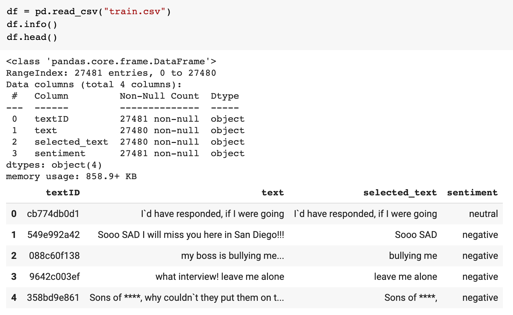
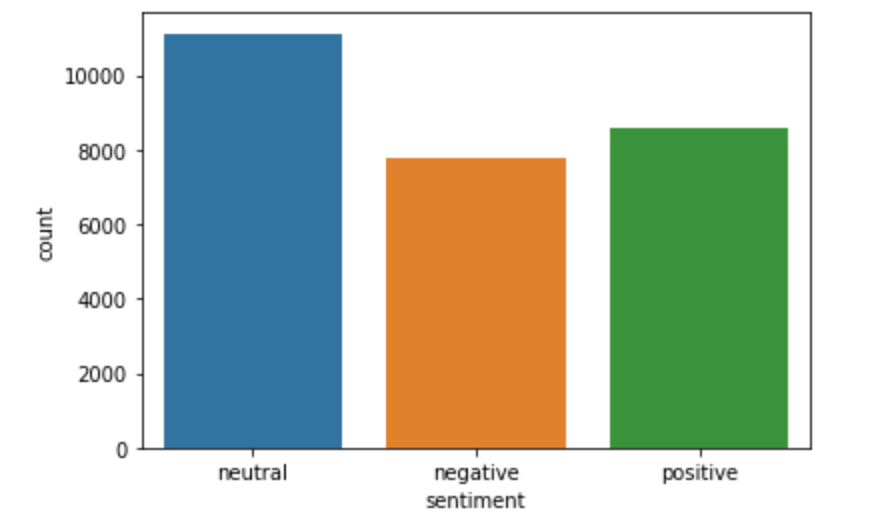
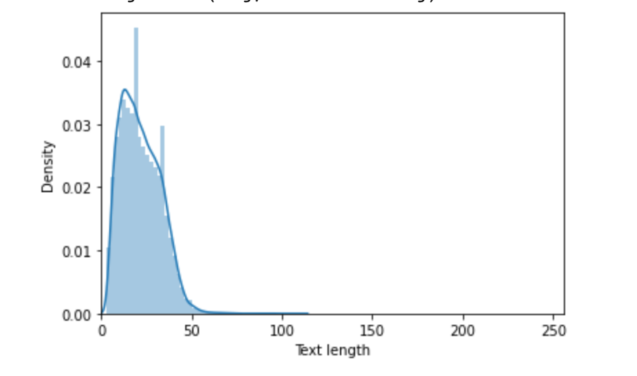
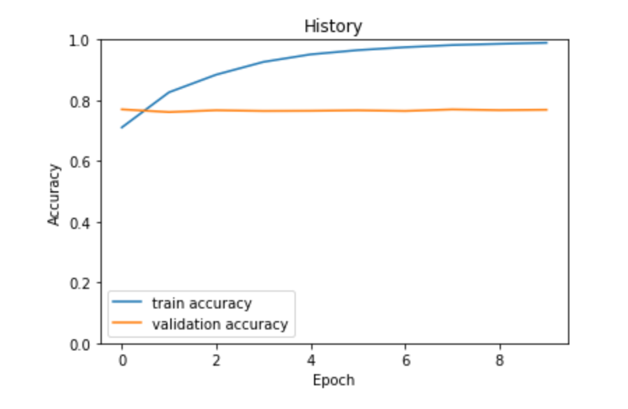

# [Video](https://youtu.be/ZmonLq-5tYM)

# Objective
Tweet sentiment analysis, the training/test data are from the [Kaggle](https://www.kaggle.com/c/tweet-sentiment-extraction/data). Here is the original [project proposal](https://docs.google.com/document/d/1lWHdD9wxFcGoTYYpAAGPzRflJiHCXd6duoHrqs3XwNE/edit?usp=sharing).
* Use Pytorch Dataset/Dataloader to pre-process the text data
* Understand the Transformers and BERT
* Use Transfer learning to build sentiment classisifer with Hugging Face Transformers library
* Evaluate the model on the test data

# Data Analysis

The training data set has 27481 rows, and each row includes a textID, text, selected_text and sentiment. For simplifying this classification task, its input is text and the label is sentiment (neutral, negative and positive). Here is the sentiment distribution of the training data.


# Data Pre-processing
We will do the following per BERT requirements via Hugging Face Transformers library in this section.
* Add special tokens to separate the sentences
* Choose a fixed sequence length and add paddings for those length less than the choose length
* Create the attention mask

Specifically, [BertTokenizer](https://huggingface.co/transformers/model_doc/bert.html#berttokenizer) is for helping with word embeddings. It can be initialized with pre-trained model.
```
tokenizer = BertTokenizer.from_pretrained('bert-base-cased')
```
Also this class provides the special tokens like
* `[SEP]`: the separator token, which is used when building a sequence from multiple sequences
* `[CLS]`: the classifier token which is used when doing sequence classification
* `[PAD]`: the token used for padding, for example when batching sequences of different lengths

BERT works with fixed length sequences, so we need to choose a length, here is the text length distribution of the training data.

From the above, `150` is a good number.

Here is the data set abstraction by extending the Pytorch `Dataset` class.
```
MAX_LENGTH = 150
SENTIMENT = {
    'positive' : 0,
    'neutral': 1,
    'negative': 2
}

class TweetsDataset(Dataset):
  def __init__(self, tweets, labels):
    self.tweets = tweets
    self.labels = labels
  
  def __len__(self):
    return len(self.tweets)
  
  def __getitem__(self, i):
    tweet = self.tweets[i]
    label = self.labels[i]
    encoding = tokenizer.encode_plus(
        str(tweet), 
        add_special_tokens=True, 
        max_length=MAX_LENGTH, 
        return_token_type_ids=False, 
        pad_to_max_length=True,
        return_attention_mask=True,
        return_tensors='pt'
    )
    return {
        'tweet': tweet,
        'label': torch.tensor(SENTIMENT[label], dtype=torch.long),
        'input_ids': encoding['input_ids'].flatten(),
        'attention_mask': encoding['attention_mask'].flatten(),
    }
```
Also we use 20% of the training data for the model validation.
```
df = pd.read_csv("train.csv")
df_test = pd.read_csv('test.csv')
df_train, df_val = train_test_split(df, test_size=0.2, random_state=42)
```
Note: `train.csv` and `test.csv` is from the [Kaggle](https://www.kaggle.com/c/tweet-sentiment-extraction/data).

Finally, we use Pytorch [`DataLoader`](https://pytorch.org/docs/1.7.1/data.html#torch.utils.data.DataLoader) for the batch loading the dataset and its iterate capability.
```
ds_train = TweetsDataset(df_train.text.to_numpy(), df_train.sentiment.to_numpy())
ds_val = TweetsDataset(df_val.text.to_numpy(), df_val.sentiment.to_numpy())
ds_test = TweetsDataset(df_test.text.to_numpy(), df_test.sentiment.to_numpy())

BATCH_SIZE = 16
dl_train = DataLoader(ds_train, batch_size=BATCH_SIZE, num_workers=4)
dl_val = DataLoader(ds_val, batch_size=BATCH_SIZE, num_workers=4)
dl_test = DataLoader(ds_test, batch_size=BATCH_SIZE, num_workers=4)
```

# Model & Training
Basically, we leverage Transfer Learning, so most of training work are delegated to the BERT pre-trained model, here is the classifier.
```
NUM_CLASSES = 3

class SentimentClassifier(nn.Module):
  def __init__(self):
    super(SentimentClassifier, self).__init__()
    self.bert_model = BertModel.from_pretrained('bert-base-cased')
    self.drop = nn.Dropout(p=0.3)
    self.out = nn.Linear(self.bert_model.config.hidden_size, NUM_CLASSES)
  
  def forward(self, input_ids, attention_mask):
    bert_outputs = self.bert_model(
      input_ids=input_ids,
      attention_mask=attention_mask
    )
    output = self.drop(bert_outputs.pooler_output)
    return self.out(output)
```
The main idea of finding the best model is to train the model in multiple epochs and save the one with the best accuracy. We're using hyperparameters recommended in BERT paper.
* Batch size: 16
* Learning rate: 2e-5

Regarding the epochs, we're using 10 to see if accuracy is improved with larger epochs.Here is the experimentation result.


We know that as the epochs is increased, the training accuracy is increase and become closer to 1.
```
Epoch 1/10: 
Train loss 0.6853332175958625 accuracy 0.7104712518195051
Val loss 0.5682900819580915 accuracy 0.7700563943969438

Epoch 2/10:
Train loss 0.45867468857815086 accuracy 0.8263737263464338
Val loss 0.63601977588219 accuracy 0.7611424413316354


Epoch 3/10:
Train loss 0.33158209399636046 accuracy 0.8844159388646289
Val loss 0.7496250784024596 accuracy 0.7671457158450065

Epoch 4/10:
Train loss 0.24776545977758804 accuracy 0.926401018922853
Val loss 0.9736509345455615 accuracy 0.7647807895215573

Epoch 5/10:
Train loss 0.18693198364834995 accuracy 0.9512372634643378
Val loss 1.1983984652879582 accuracy 0.7653265417500456

Epoch 6/10:
Train loss 0.14573897955836823 accuracy 0.9652019650655023
Val loss 1.3200521655380726 accuracy 0.7669637984355103

Epoch 7/10:
Train loss 0.11434614181857802 accuracy 0.9747998544395925
Val loss 1.4255867470800334 accuracy 0.7647807895215573

Epoch 8/10:
Train loss 0.08640725832998318 accuracy 0.9819414119359534
Val loss 1.4944015391550682 accuracy 0.7698744769874477

Epoch 9/10:
Train loss 0.06910085754147581 accuracy 0.9859898107714702
Val loss 1.5213720954077787 accuracy 0.7675095506639986

Epoch 10/10:
Train loss 0.05493503184382447 accuracy 0.9894923580786027
Val loss 1.5474589450405316 accuracy 0.7687829725304712
```

# Evalution
Here is the model evaluation result on the test data, it's a little lower than the accurancy on the validation data set, so it generalizes well. 
```
Test accuracy: 0.7744765138653085
```

# Inference
In this section, I will use the best trained model for the sentiment prediction.
```
CLASS_NAMES = {
    0: 'postive',
    1: 'neutral',
    2: 'negative',
}

texts = ['I love this app, best ever!', 'So sad, it is not working']

for text in texts:
  encoded_text = tokenizer.encode_plus(
    text,
    max_length=MAX_LENGTH,
    add_special_tokens=True,
    return_token_type_ids=False,
    pad_to_max_length=True,
    return_attention_mask=True,
    return_tensors='pt',
  )

  output = classifier(encoded_text['input_ids'].to(device), encoded_text['attention_mask'].to(device))
  _, prediction = torch.max(output, dim=1)

  print(f'Text: {text}')
  print(f'Sentiment  : {CLASS_NAMES[prediction.item()]}')
```
Here are the results.
```
Text: I love this app, best ever!
Sentiment  : postive

Text: So sad, it is not working
Sentiment  : negative
```

# References
* [Sentiment Analysis with BERT and Transformers by Hugging Face using PyTorch and Python](https://curiousily.com/posts/sentiment-analysis-with-bert-and-hugging-face-using-pytorch-and-python/)
* [Attention Is All You Need](https://arxiv.org/abs/1706.03762)
* [BERT: Pre-training of Deep Bidirectional Transformers for Language Understanding](https://arxiv.org/abs/1810.04805)
